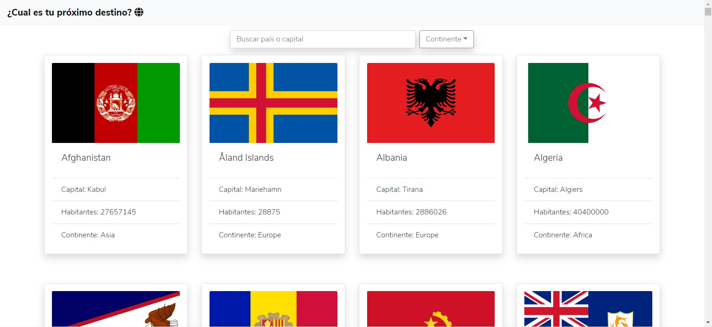
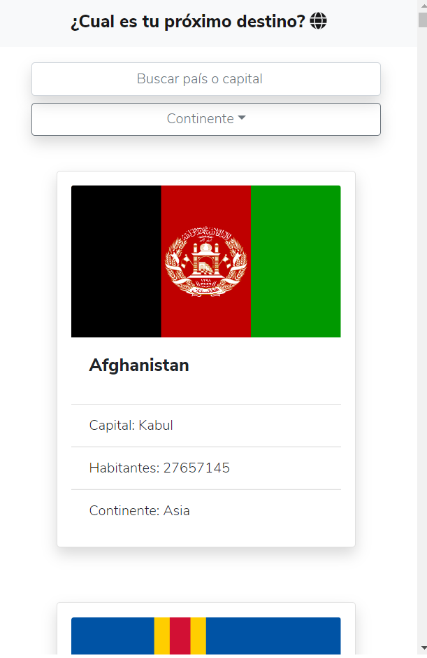
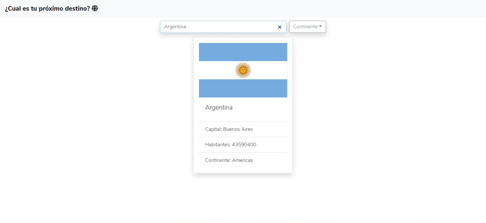
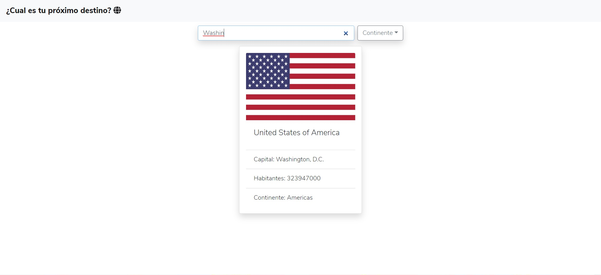
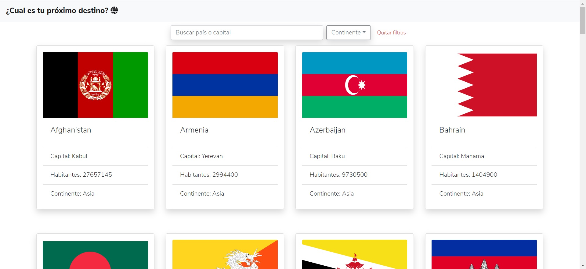
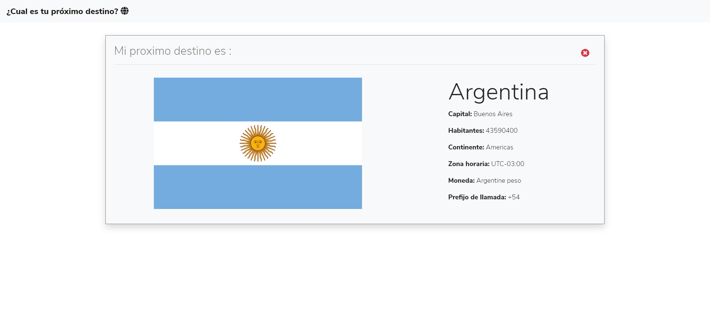
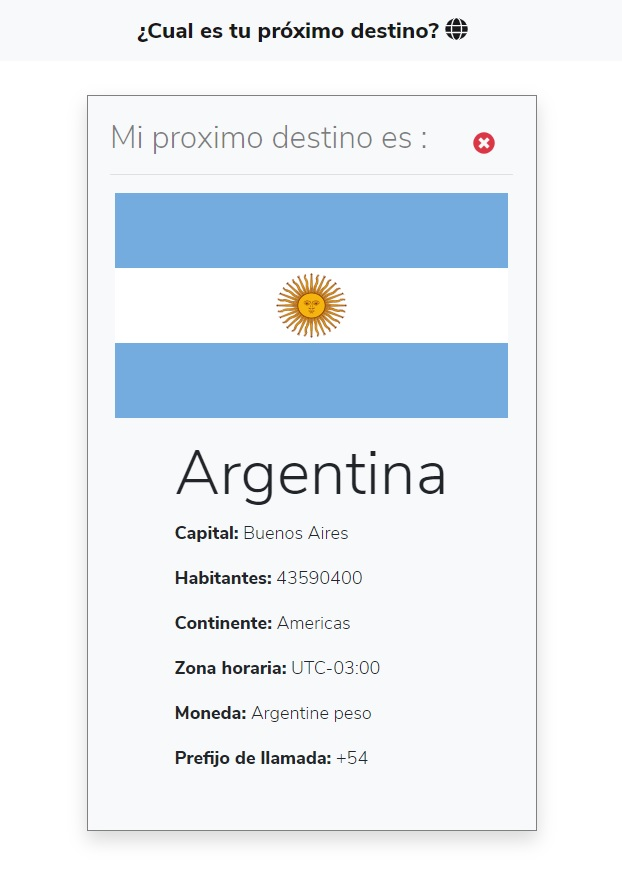

# Frontend Mentor - REST Countries API

## Welcome! 👋

Hi, thanks for watch my project!  
My name is Ezequiel, i'm from Córdoba, Argentina. I'm a full stack web developer [REACT, REDUX, NODEJS, POSTGRESQL]  
- This project is a challenge from https://www.frontendmentor.io/
- The project was done with React, React Router, Hooks, Redux consuming a REST API (https://restcountries.eu/)

##______________________________

- This is the home of the desktop site  

- This is the home of the mobile site   

- Filtered by country name  

- Filtered by capital name  

- Filtered by region with button for cleaning filter  

- This is a country detail of the desktop site  

- This is a country detail of the mobile site  

